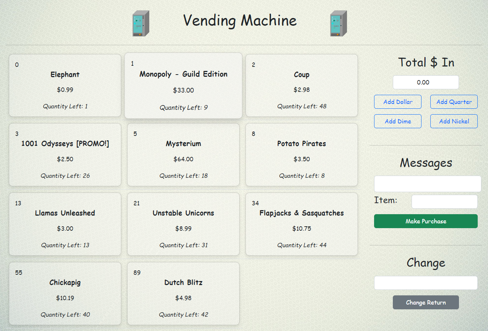

# Vending Machine REST Client

A RESTful web application used to simulate the process of a vending machine. Lists items currently for sale along with the Id, price, and remaining quantities. The user is able to insert money, select an item, and will receive their change in coin type quantities after the transaction. All potential errors are properly handled.

(Makes AJAX calls to an external API)

Technologies Used:

](https://skills.thijs.gg)

